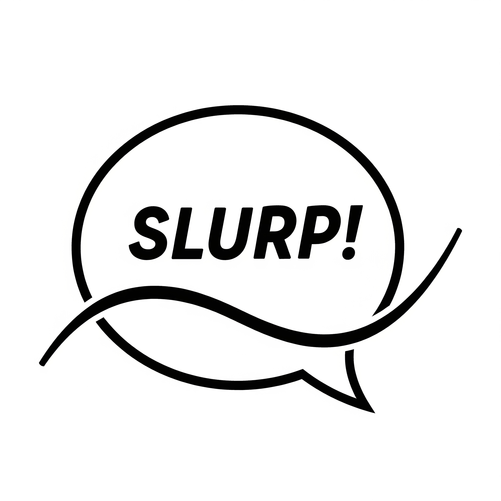

# slurp

  

## Introduction
Library to handle Generalised (not) Additive Models (GnAM).

They are models inspired on GAM but without the additive model design constraint.

In practice you can make operations between splines (multiplications, concatenation, divsions...).

The package is based on `autograd` and `scipy.optimize.minimize` for optimisation.

## Tiny demo

For an interactive demo visit this [marimo notebok](https://molab.marimo.io/notebooks/nb_j74QkoTbpCrLxSEnE5EKLg) on molab.

## Road map
- [] Compatibility with polars input.
- [] Integrated visualisation features using `altair`
- [] Implementation spline as `torch` modules and optimisation using SGD and neural networks structure.
